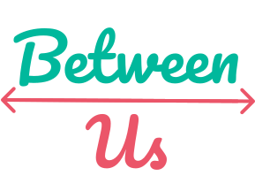

# Between Us

A social distancing regulation API built on top of [openpifpaf](https://github.com/vita-epfl/openpifpaf) and [Monoloco](https://github.com/vita-epfl/monoloco).

## Problem

There are tons of research-level resources for estimating social distance from images, just to name a few:
- https://github.com/Ank-Cha/Social-Distancing-Analyser-COVID-19
- https://github.com/ParthPathak27/Social-Distancing-Detector
- https://github.com/deepak112/Social-Distancing-AI
- https://github.com/aqeelanwar/SocialDistancingAI
- https://github.com/IIT-PAVIS/Social-Distancing
- https://github.com/neuralet/smart-social-distancing

... but **none** of them offer a ready to use API for live or async analysis of images.

## Solution

We built a simple, ready to use API based on the leading solution at the time of writing this.\
We tweaked the social distancing algorithm to cover most common cases.

## Usage

See [betweenus-api/README.md](betweenus-api/README.md)

## Demo

We also built a demo web app that showcases the power of the API.

### Usage

See [betweenus-react/README.md](betweenus-api/README.md)