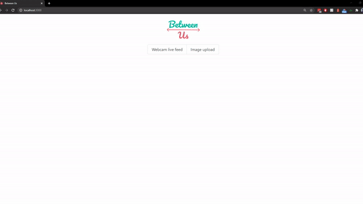

# Between Us API demo app

Demo app that queries the API with images (either uploaded or from the webcam), then renders the JSON output in a HTML canvas element as bounding boxes, indicating violations of the social distancing protocol.


## Features

### Upload mode


### Webcam mode



## Setup

### Requirements
- Node
- yarn

### Install dependencies
```
yarn
```


## Usage

### Start a local server
```
yarn start
```

### Build for deployment
```
yarn build
```


## Approach

### Upload mode
Simply POSTing the image to the API and waiting for a JSON response, then rendering the output.

### Webcam mode
Poll a screenshot from the webcam behind the scenes and feed it to the API.\
Once a response is received, render the output and restart the process.

### Rendering the output
Build a HTML canvas of the same size as the image and set the image as background.\
For each bounding box, draw a rectangle of the appropriate color in the corresponding right position.\
Draw a small coronavirus image for each person found to not be respecting the social distancing norms.\
Listen for changes to props and re-render.

## Credits
- [Create React App](https://github.com/facebook/create-react-app)
- Inspiration from [react-bounding-box](https://github.com/alx/react-bounding-box), but we ended up writing our own Canvas bounding box rendering component
- [react-webcam](https://github.com/mozmorris/react-webcam)
- [bulma](https://github.com/jgthms/bulma)
